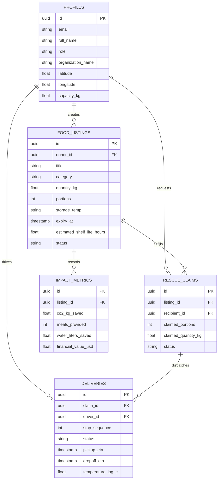
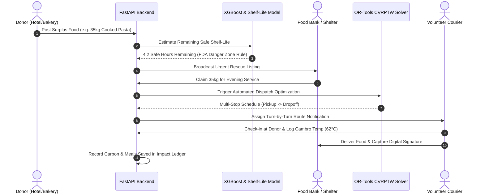

# FoodLoop AI - Architectural Blueprint & System Design

FoodLoop AI is an end-to-end intelligent platform engineered to eliminate food waste at scale by pairing surplus donors (hotels, caterers, supermarkets, restaurants) with non-profit recipients (food banks, shelters, community kitchens) and deploying volunteer couriers via automated multi-stop route optimization.

---

## 1. High-Level System Architecture

```mermaid
graph TD
    subgraph Client Layer
        A1[Next.js App Router]
        A2[Tailwind CSS & shadcn/ui]
        A3[Interactive Dispatch Map Canvas]
        A4[AI Culinary & Safety Co-Pilot]
    end

    subgraph API Gateway & Backend
        B1[FastAPI Microservices]
        B2[Supabase Auth & RBAC Middleware]
        B3[SQLAlchemy ORM Engine]
    end

    subgraph Intelligence & Optimization Layer
        C1[XGBoost Surplus Predictor]
        C2[Thermodynamic Shelf-Life Engine]
        C3[Google OR-Tools CVRPTW Solver]
        C4[Provider-Agnostic LLM Layer]
        C5[RAG Semantic Vector Knowledge Base]
    end

    subgraph Data & Storage Layer
        D1[(PostgreSQL / Supabase)]
        D2[PostGIS & pgvector]
        D3[Supabase Storage Buckets]
    end

    Client Layer -->|REST API & WebSockets| B1
    B1 --> B2
    B2 --> B3
    B1 --> C1
    B1 --> C2
    B1 --> C3
    B1 --> C4
    B1 --> C5
    B3 --> D1
    C5 --> D2
```

---

## 2. Entity-Relationship Diagram (ERD)



---

## 3. End-to-End Rescue Sequence Flow



---

## 4. Key Architectural Decisions

1. **Provider-Agnostic LLM Layer**: Decoupled with an abstract base class pattern. Works identically on Google Gemini (`gemini-1.5-flash`), OpenAI (`gpt-4o-mini`), or intelligent zero-dependency heuristic fallback.
2. **Resilient Solver Architecture**: Features both Google OR-Tools constraint programming and a high-performance heuristic solver (Earliest Expiry First + Capacity Clustering) ensuring zero downtime regardless of host OS C++ binary support.
3. **Database Dual-Compatibility**: Models designed to work both with Supabase PostgreSQL (with PostGIS and pgvector) and local SQLite instances during edge deployments or local testing.
