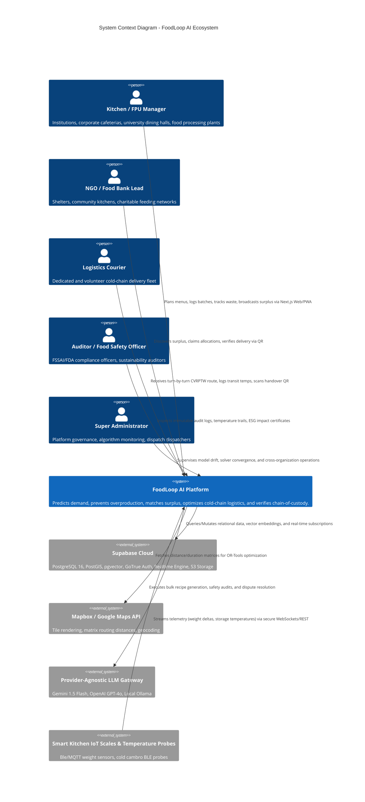

# FOODLOOP AI — Master Architecture & Engineering Specification

An end-to-end, SIH-grade architectural specification for **FoodLoop AI**: an AI-powered smart food reduction, waste forecasting, and sustainable redistribution ecosystem for institutional kitchens, food processing units, NGOs, and cold-chain logistics.

---

## 1. System Architecture Document

### 1.1 Context & Container Architecture (C4 Model)



```mermaid
graph TB
    subgraph Client Layer [Frontend - Next.js 14 App Router & TypeScript]
        UI_KITCHEN[Institutional Kitchen Dashboard]
        UI_NGO[NGO & Food Bank Portal]
        UI_DRIVER[Courier Turn-by-Turn Mobile PWA]
        UI_ADMIN[Super Admin & Auditor Console]
        UI_COPILOT[AI Safety & Recipe Drawer]
        UI_STATE[Zustand Store / TanStack Query v5]
        UI_COMPONENTS[shadcn/ui + Tailwind CSS + Recharts]
    end

    subgraph Gateway Layer [FastAPI Asynchronous Gateway]
        API_GATEWAY[FastAPI Core Server :8000]
        MIDDLEWARE_AUTH[Supabase JWT & RBAC Middleware]
        MIDDLEWARE_CORS[Strict CORS & Host Header Guard]
        MIDDLEWARE_AUDIT[Tamper-Proof Audit & Request Tracing]
        MIDDLEWARE_RATE[Sliding-Window Rate Limiter]
    end

    subgraph Service Layer [Hexagonal Business & Domain Services]
        SVC_INV[Inventory & Shelf-Life Service]
        SVC_PROD[Production & Waste Service]
        SVC_FORECAST[Demand Forecasting Service]
        SVC_MATCH[Bipartite Matching Engine]
        SVC_VRP[OR-Tools CVRPTW Dispatch Engine]
        SVC_QR[Cryptographic Handover QR Service]
        SVC_RAG[pgvector Semantic Retrieval Service]
        SVC_LLM[Provider-Independent LLM Adapter]
        SVC_VISION[Computer Vision Quality Inspection Service]
        SVC_IMPACT[GHG & ESG Impact Ledger Service]
    end

    subgraph AI/ML Engine [Python ML Subsystem]
        ML_DEMAND[XGBoost / LightGBM Demand Forecaster]
        ML_SPOILAGE[Thermodynamic Arrhenius Spoilage Model]
        ML_VRP[Google OR-Tools Guided Local Search]
        ML_CV[PyTorch / Torchvision ResNet50 Freshness Classifier]
        ML_MONITOR[Evidently / PSI Model Drift Monitor]
    end

    subgraph Data Layer [Supabase Managed PostgreSQL 16]
        DB_RELATIONAL[(Relational Tables: Orgs, Inventories, Menus, Donations)]
        DB_POSTGIS[(PostGIS: Spatial Geometry & Route Waypoints)]
        DB_VECTOR[(pgvector: Regulations, SOPs, Food Code Embeddings)]
        DB_LOGS[(Audit Trails & Immutable Sensor Telemetry)]
    end

    Client Layer -->|HTTPS / WSS / JWT| API_GATEWAY
    API_GATEWAY --> MIDDLEWARE_AUTH
    MIDDLEWARE_AUTH --> MIDDLEWARE_AUDIT
    MIDDLEWARE_AUDIT --> Service Layer
    Service Layer --> AI/ML Engine
    Service Layer --> Data Layer
    AI/ML Engine --> Data Layer
```

---

## 2. Complete Monorepo Folder Structure

```
Food_Loop_AI/
├── .github/workflows/ci.yml             # Linting, Pytest, Security AST scanner
├── frontend/                           # Next.js 14 App Router Application
│   ├── src/app/                        # Next.js App Router (RSC & Client components)
│   ├── src/components/                 # DispatchMap, ListingCard, DonateModal, AICoPilot
│   ├── src/lib/                        # api.ts, supabase.ts client instances
│   └── src/types/                      # TypeScript entity and API contracts
├── backend/                            # FastAPI Microservices Monolith
│   ├── app/core/                       # Config, database engine, security, RBAC
│   ├── app/models/                     # SQLAlchemy 2.0 ORM models
│   ├── app/schemas/                    # Pydantic v2 schemas
│   ├── app/services/                   # OR-Tools, ML, RAG, LLM adapters
│   └── app/api/v1/                     # REST API routers
├── ml/                                 # ML & Optimization Pipeline
│   ├── dataset_generator.py            # Synthetic dataset generator
│   ├── train_surplus_model.py          # XGBoost regressor & classifier training
│   ├── shelf_life_estimator.py         # Arrhenius & FDA 4-hour danger zone logic
│   ├── predict.py                      # Real-time inference
│   └── models/                         # Serialized artifacts (.joblib, metrics.json)
├── database/                           # Database Migrations & Seeds
│   ├── schema.sql                      # Complete DDL script
│   └── seed.sql                        # Realistic demo data
├── docs/                               # Architectural & Engineering Specifications
│   ├── ARCHITECTURE.md
│   ├── API_REFERENCE.md
│   ├── DISPATCH_OPTIMIZATION.md
│   ├── RAG_AND_LLM.md
│   └── MASTER_ARCHITECTURE_SPECIFICATION.md
├── tests/                              # Pytest test suite (100% passing)
├── infrastructure/                     # Docker Compose, Dockerfiles, Vercel config
└── README.md                           # Developer onboarding and system documentation
```

---

## 3. Database ERD & Entity Specifications

Entities:
- `organizations`
- `profiles`
- `kitchens`
- `food_processing_units`
- `raw_inventory_items`
- `menus`
- `recipes`
- `production_batches`
- `consumption_logs`
- `waste_logs`
- `surplus_listings`
- `rescue_claims`
- `vehicles`
- `dispatch_deliveries`
- `route_waypoints`
- `qr_verification_tokens`
- `impact_ledger_entries`
- `knowledge_documents`
- `audit_logs`

---

## 4. Phase-by-Phase Roadmap

- **Phase 0**: Foundational Setup, System Architecture, Repository Structure, Baseline Tooling & Health Checks (Completed)
- **Phase 1**: Core Foundation, Database Schema Migration & Supabase RBAC Integration
- **Phase 2**: Kitchen & FPU Operational Management (Inventory, Menu, Production, Consumption, Waste)
- **Phase 3**: AI Demand Forecasting, Spoilage Modeling & Production Buffer Optimization
- **Phase 4**: Surplus Management, Recipient Bipartite Matching & Donation Claims
- **Phase 5**: Google OR-Tools CVRPTW Logistics Dispatch & Zero-Trust QR Chain of Custody
- **Phase 6**: AI Co-Pilot, Vector RAG, Computer Vision Freshness Inspection & ESG Impact Ledger
